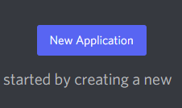
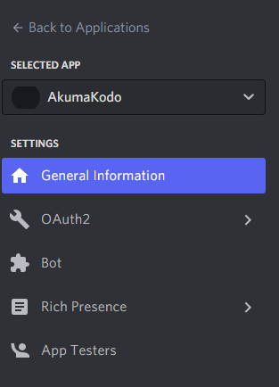
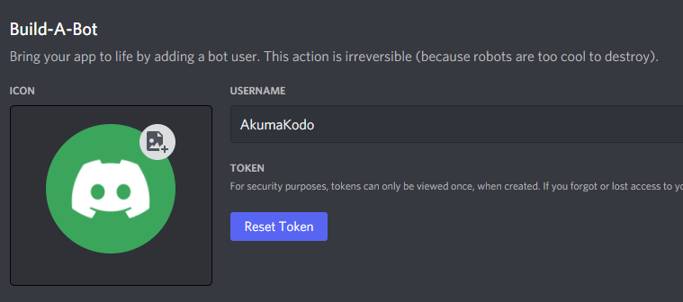

# New Discord Bot Developers

## Programming basics

Before starting, you should have a basic understanding of how to write code in typescript.
Typescript fundamentals are needed to use and extends this framework to the fullest extent.

Learn about [typescript](https://www.typescriptlang.org/docs/handbook/typescript-from-scratch.html) here.

If you are new to programming with the discord api I also recommend read the [discord api documentation](https://discord.com/developers/docs/intro).
You can find a lot of helpful information there. Check out the [Seven Steps](../../misc/seven_steps.md) if you have not already 😁!

You can also learn more about discord bot development on YouTube, in discord servers, and reddit.

## Creating a bot application

Assuming your reading to make your first discord bot, we will start with the basics.

First, we need to go to the discord developer [portal](https://discord.com/developers/applications) and create a bot account.

Next click on the bot tab and create a new bot application.

Your bot should be created.

Make sure to copy and paste your token for later than you will need this to authenticate with the discord api.

Now that you have a bot application, you can connect to the AkumaKodo framework and start creating your bot! Keep reading in the next chapter.
